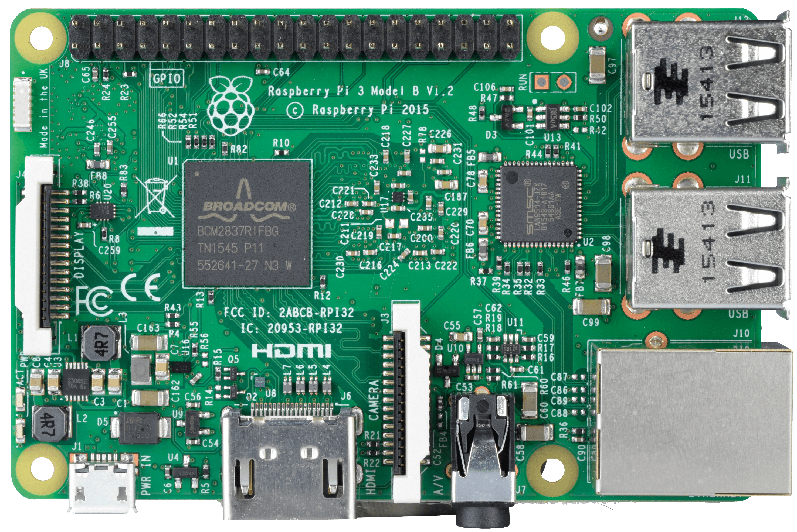
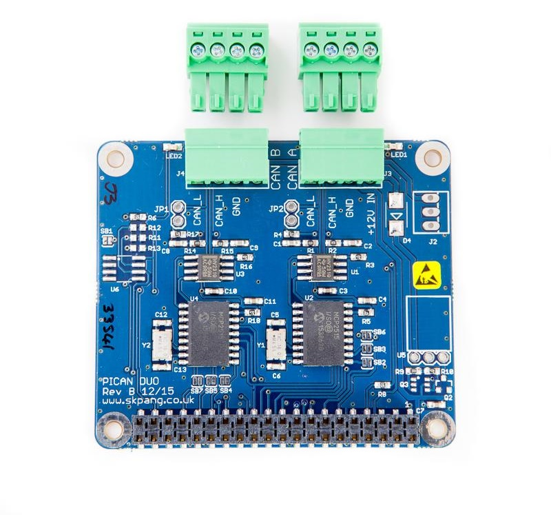

# A repository for useful raspberry pi scripts

   
  

## Scripts
- [can_interfaces.sh](https://github.com/bierschi/raspberry_pi_scripts#can_interfacessh)

- [establish_ppp_connection.sh](https://github.com/bierschi/raspberry_pi_scripts#establish_ppp_connectionsh)

- [hifiberry_configuration.sh](https://github.com/bierschi/raspberry_pi_scripts#hifiberry_configurationsh)

- [serial_connection.sh](https://github.com/bierschi/raspberry_pi_scripts#serial_connectionsh)

## script execution
make your script executable:
<pre><code>
chmod +x your_script.sh
</pre></code>

 

Type in terminal: `./your_script.sh`

## can_interfaces.sh
Executing the `can_interfaces.sh` script, you can load the "can0" and/or the
"can1" interface. Depending if you use the pican2 (only "can0") or the
pican2 duo board("can0" and "can1") .

Tested only with the pican2 and the pican2 duo board containing the MCP2515 CAN controller
with the MCP2551 CAN transceiver

 

  
  
   

## establish_ppp_connection.sh

## hifiberry_configuration.sh
Executing the `hifiberry_configuration.sh` script, you can select one
depending on your dac soundcard from hifiberry

- hifiberry-dac
- hifiberry-dacplus
- hifiberry-digi
- hifiberry-amp

## serial_connection.sh

The default setting on GPIO 14 and 15 is the mini uart (ttyS0) (new bluetooth module). To change this settings, we have to load the correct
device tree overlay `pi3-miniuart-bt`.

DTO `pi3-miniuart-bt` switches the Raspberry Pi 3 and Raspberry Pi Zero W Bluetooth
function to use the mini UART (ttyS0), and restores UART0/ttyAMA0 to
GPIOs 14 and 15.

 

#### Output of dmesg

 

**output from a new raspbian image**

  

 

**output after activate the mini uart (ttyS0)**

  

 

**output after activate the powerful uart (ttyAMA0)**

  

 

#### Test the serial connection

install minicom to interact with the uart
<pre><code>
sudo apt install minicom
</pre></code>

option -b is the baudrate, select the appropriate baudrate for your use case

if you use the mini uart, insert following command in terminal:
<pre><code>
minicom -b 9600 -D /dev/ttyS0
</pre></code>

if you use the powerful uart, insert following command in terminal:
<pre><code>
minicom -b 9600 -D /dev/ttyAMA0
</pre></code>
